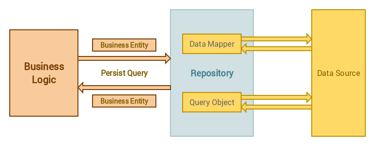
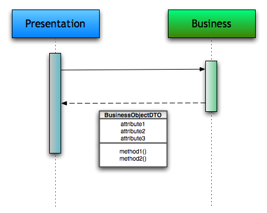

# Service Repository Pattern



Merupakan pendekatan dengan memisahkan business logic dan query logic bertujuann untuk membangun sebuah aplikasi yang mudah di maintenance. Pendekatan ini sangat barguna sekali pada aplikasi yang kompleks yang dimana kita harus memanajemen business logic dan akses data secara efektif dan mengurangi redudansi atau penulisan algoritma kode secara berulang.

Dalam kasus proyek ini, Saya memisahkan antara controller, service, dan repository. Controller akan mengatur route dan request dari user, selanjutnya akan diteruskan oleh service yang akan mengolah data input, lalu setelahnya akan dilanjutkan oleh repository sebagai data acces untuk melakukan proses simpan, hapus, ubah ke dalam database.

**Contoh Penulisan Controller**

```
import {
  Controller,
  Get,
  Post,
  Body,
  Patch,
  Param,
  Delete,
} from '@nestjs/common';
import { UsersService } from './users.service';
import { CreateUserDto } from './dto/create-user.dto';
import { UpdateUserDto } from './dto/update-user.dto';

@Controller('users')
export class UsersController {
  constructor(private readonly usersService: UsersService) {}

  @Post()
  create(@Body() createUserDto: CreateUserDto) {
    return this.usersService.create(createUserDto);
  }

  @Get()
  findAll() {
    return this.usersService.findAll();
  }

  @Get(':UUID')
  findOne(@Param('UUID') UUID: string) {
    return this.usersService.findOne(UUID);
  }

  @Patch(':UUID')
  update(@Param('UUID') UUID: string, @Body() updateUserDto: UpdateUserDto) {
    return this.usersService.update(UUID, updateUserDto);
  }

  @Delete(':UUID')
  remove(@Param('UUID') UUID: string) {
    return this.usersService.remove(UUID);
  }
}
```

**Contoh Penulisan service**

```
import { Injectable } from '@nestjs/common';
import { CreateBookDto } from './dto/create-book.dto';
import { UpdateBookDto } from './dto/update-book.dto';
import { Book } from './entities/book.entity';
import { InjectRepository } from '@nestjs/typeorm';
import { Repository } from 'typeorm';
import { Category } from '../categories/entities/category.entity';

@Injectable()
export class BooksService {
  constructor(
    @InjectRepository(Book) private readonly bookRepository: Repository<Book>,
    @InjectRepository(Category)
    private readonly categoryRepository: Repository<Category>,
  ) {}

  async create(createBookDto: CreateBookDto) {
    const categories: Array<Category> = await Promise.all(
      createBookDto.categories.map(async (categoryUUID) => {
        const category = await this.categoryRepository.findOneByOrFail({
          UUID: categoryUUID.toString(),
        });
        return category;
      }),
    );

    const book: Book = new Book();
    book.title = createBookDto.title;
    book.description = createBookDto.description;
    book.publishedYear = createBookDto.publishedYear;
    book.price = createBookDto.price;
    book.categories = categories;
    book.authors = createBookDto.authors;
    return await this.bookRepository.save(book);
  }

  async findAll() {
    return await this.bookRepository.find();
  }

  async findOne(UUID: string) {
    return await this.bookRepository.findOneByOrFail({ UUID });
  }

  async update(UUID: string, updateBookDto: UpdateBookDto) {
    let categories: Array<Category>;
    if (updateBookDto.categories) {
      categories = await Promise.all(
        updateBookDto.categories.map(async (categoryUUID) => {
          const category = await this.categoryRepository.findOneByOrFail({
            UUID: categoryUUID.toString(),
          });
          return category;
        }),
      );
    }

    const book: Book = new Book();
    book.title = updateBookDto.title;
    book.description = updateBookDto.description;
    book.publishedYear = updateBookDto.publishedYear;
    book.price = updateBookDto.price;
    book.categories = categories;
    book.authors = updateBookDto.authors;
    return await this.bookRepository.update(UUID, book);
  }

  async remove(UUID: string) {
    return await this.bookRepository.delete(UUID);
  }
}
```

Jadi dalam kode diatas, bisa dilihat bahwasanya dalam controller lebih ringkas, karena logika bisnisnya ditulis pada service layer, dan controller hanya menghandle request dari view. selanjutnya untuk repository itu sudah di handle oleh bawaan TypeORM sendiri. Jadi, kita tidak perlu untuk melakukan penulisan kode repository. Pada umumnya jika kita tidak menggunakan library atau dikerjakan secara native. kita perlu menulis query-query ke dalam data base untuk membuat repository.

# DTO (Data Transfer Object) Pattern



DTO merupakan objek yang dirancang untuk membawa data antar proses dalam sebuah aplikasi. hal ini berguna untuk menjaga konsistensi data, meningkatkan keamanan data dan kinerja aplikasi.

Dalam kasus ini, data request dari view atau presentation layer akan disimmpan pada DTO dan akan divalidasi untuk inputnya. Kemudaian DTO ini akan membawa data untuk diolah lebih lanjut ke dalam business layer dan data layer. Jadi data input tidak akan secara langsung diolah, namun akan disimpan pada DTO. Hal ini akan menjaga konsistensi dan efisiensi karena tidak melakukan pemanggilan berulang, hanya cukup memanggil DTO untuk pemrosesan lebih lanjut.

**Contoh Penulisan DTO**

```
import {
  IsString,
  IsNotEmpty,
  IsNumber,
  IsOptional,
  IsArray,
} from 'class-validator';
import { Author } from 'src/authors/entities/author.entity';
import { Category } from 'src/categories/entities/category.entity';

export class CreateBookDto {
  @IsString()
  @IsNotEmpty()
  title: string;

  @IsString()
  @IsOptional()
  description: string;

  @IsNumber()
  @IsNotEmpty()
  publishedYear: number;

  @IsNumber()
  @IsNotEmpty()
  price: number;

  @IsArray()
  @IsNotEmpty()
  categories: Category[];

  @IsArray()
  authors: Author[];
}
```

Dalam kode diatas bisa dilihat untuk DTO akan memvalidasi data input dari request kemudian baru akan memasuki tahapan berikutnya pada layer berikutnya, bisa dilihat dari bab sebelumnya, untuk data yang diproses adalah data yang sudah disimpan pada DTO.

# Kesimpulan

Aplikasi ini menggunakan Service Repository Pattern dan dikombinasikan dengan DTO pattern untuk menjaga peforma, efisiensi dan kemudahan untuk bisa di kembangkan ataupun di maintenance lebih lanjut.
